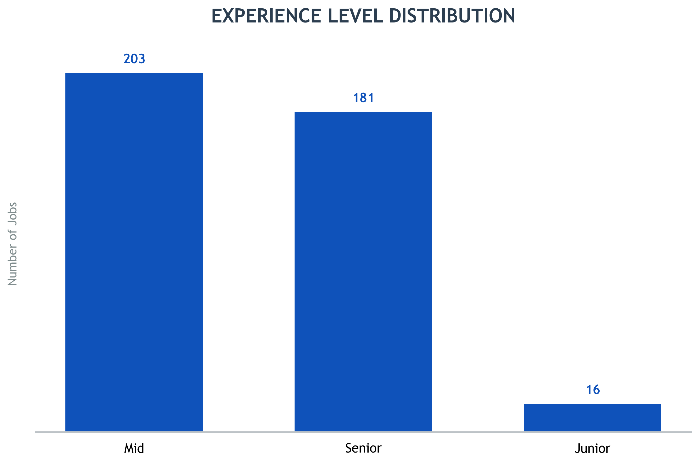
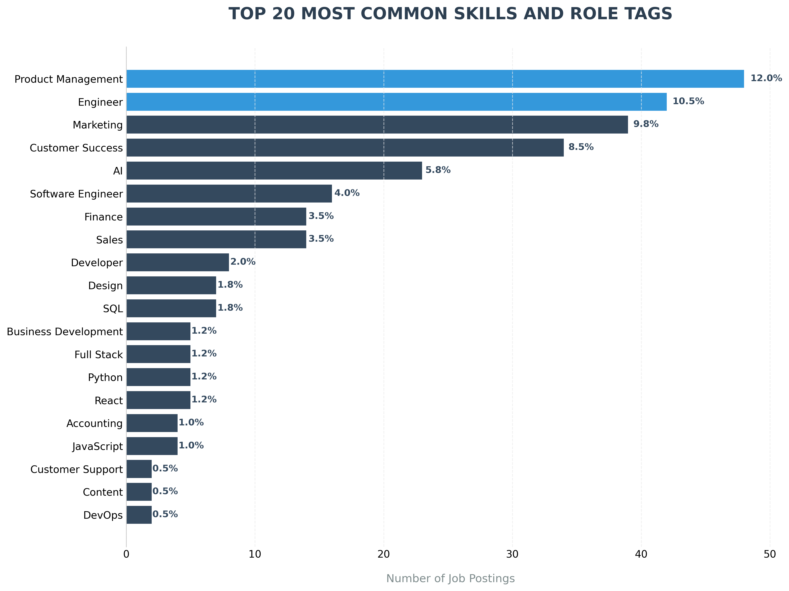
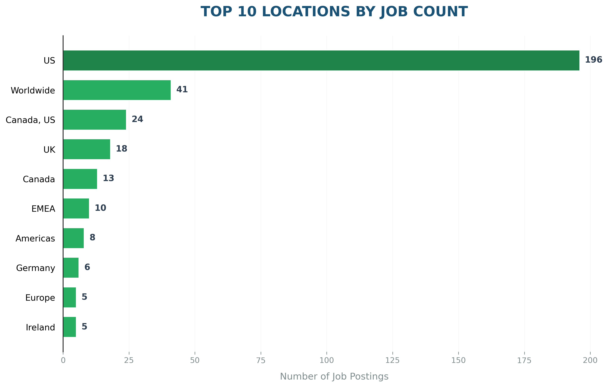
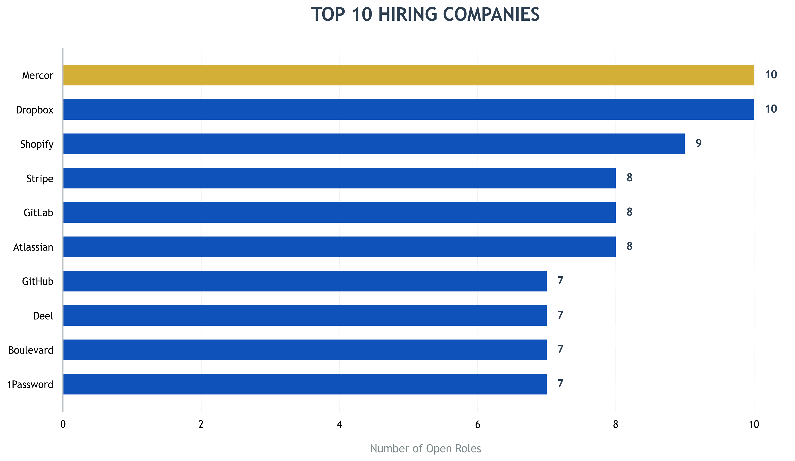
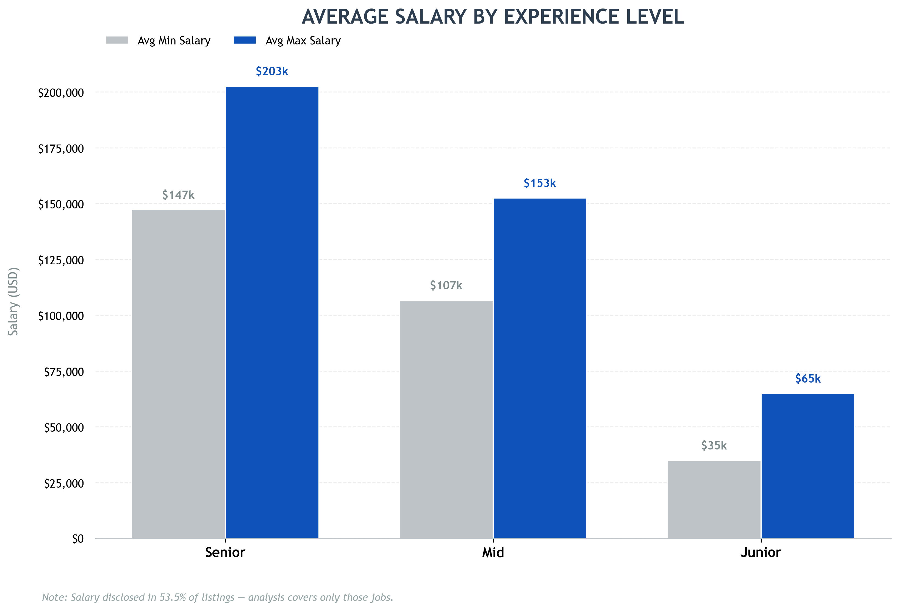
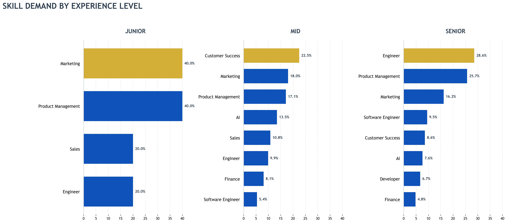
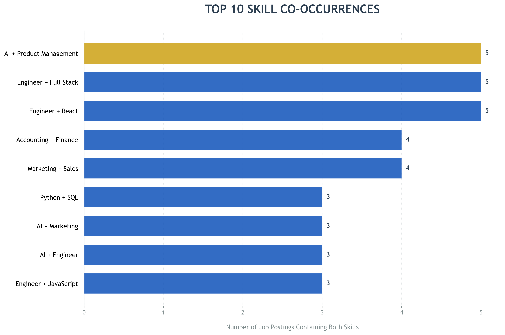
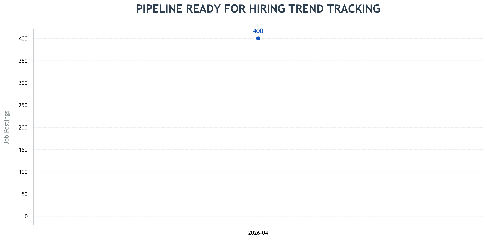

<h1 align="center">Job Market Intelligence Pipeline</h1>

<p align="center">
  <b>Web Scraping + MySQL + Python | 400+ Remote Job Listings</b><br>
  <sub>Finding which skills pay, which locations dominate, and what it actually takes to land a remote role</sub>
</p>

<p align="center">
  
  
  
  
</p>

---

## The Short Version

400 remote job listings. Scraped live. Cleaned. Stored in MySQL. Analysed end-to-end.

**Product Management** is the most in-demand tag at 12% of all listings. **49% of remote roles are US-only** — international candidates are competing for half the market they think exists. Senior remote roles pay an average maximum of **$202,672 USD**, and only **4% of roles are Junior level**.

This project goes beyond basic scraping by building a complete data pipeline and extracting decision-level insights from real job listings. It is a full data pipeline that answers real questions job seekers and hiring teams actually care about.

---

## The Core Problem

Most remote job seekers make decisions based on gut feel — which skills to learn, which companies to target, whether their salary expectations are realistic. The data to answer these questions exists. It just hasn't been pulled together and analysed properly.

This project builds a scraping pipeline that collects live remote job listings, cleans and structures the data, loads it into a relational MySQL database, and runs a full analysis to extract numbers-backed insights about how the remote job market actually works.

---

## The Single Biggest Finding

**Only 16 out of 400 remote roles — 4% — are Junior level.**

This suggests that remote hiring strongly favours experienced candidates. Junior opportunities are limited in this dataset — only 16 out of 400 listings qualify as entry-level roles. Candidates early in their career should treat this as a data point about where the market currently sits, not a permanent barrier.



---

## What the Numbers Show

| Finding | Number | What It Means |
|---|---|---|
| Total jobs scraped | 450 | From 9 categories across nodesk.co |
| After deduplication | 400 | 50 duplicate listings removed via MD5 fingerprint |
| Salary disclosed | 53.5% | Better than most real job boards |
| Most in-demand tag | Product Management — 12% | Remote teams are coordination-heavy |
| US-only listings | 49% | Half the market is closed to international candidates |
| Senior max salary (USD) | $202,672 | vs $65,000 for Junior — a $137K gap |
| Junior roles | 4% — 16 jobs | Remote hiring skews heavily toward experienced candidates |
| Top hiring company | Dropbox — 10 open roles | Alongside Mercor, Shopify, Atlassian, GitLab, Stripe |

---

## What the Data Actually Shows

### Skills and Role Tags — What Employers Are Asking For

Product Management leads at 12% of all listings. This reflects how remote-first companies are built — coordination-heavy, async-first, and reliant on people who can align distributed teams without being in the same room.

Engineer and Software Engineer together account for nearly 15% of listings, making technical roles the largest single segment. Python, React, SQL, and JavaScript appear in the bottom half of the top 20 — not because they are unimportant, but because this dataset covers all job categories, not just engineering.



---

### Location — Where the Opportunities Actually Are

The US accounts for 196 jobs — nearly half the entire dataset. This is the most important number for international candidates to understand. US-only remote roles are not accessible without work authorisation, which means international candidates are realistically competing for the other 51% of listings.

Worldwide roles at 41 jobs represent the most accessible segment of the market. If you are based outside the US or UK, filtering specifically for Worldwide listings is the most efficient job search strategy — not applying broadly and hoping.



---

### Companies — Who Is Hiring Right Now

Dropbox and Mercor lead with 10 open roles each, for completely different reasons. Dropbox is restructuring. Mercor is scaling. Both are actively hiring across multiple functions.

Shopify, Atlassian, GitLab, and Stripe cluster at 8-9 roles each. These are companies that built their culture around distributed teams before remote work was mainstream — which makes them more stable long-term employers than companies that went remote reluctantly during the pandemic.

GitLab is fully remote by default with no physical headquarters. Every role there is remote by design, not by exception.



---

### Salary — What the Market Actually Pays

Senior roles average a maximum of $202,672 USD. Mid-level roles average $152,553. Junior roles average $65,000. The gap between Junior and Senior is $137,000 — roughly a decade of career progression in most engineering and product functions.

The caveat matters: only 53.5% of listings disclosed salary. Companies that do not publish salary ranges are typically using compensation as a filtering mechanism. If a listing has no salary range, expect a longer and more uncertain negotiation.



---

### Skills by Experience Level — What Changes as You Get Senior

The skills that dominate Junior listings and the skills that dominate Senior listings are different. Some skills are table stakes at every level. Others grow significantly in importance as seniority increases — these are the ones worth investing in if career progression is the goal.



---

### Skill Co-occurrence — What Full Stacks Look Like

After filtering out overlapping tags like Engineer and Software Engineer, the strongest meaningful co-occurrence is AI and Product Management — appearing together in 5 jobs. This points to growing demand for product people who understand AI well enough to define requirements, evaluate model outputs, and make build-versus-buy decisions. That role type is one of the fastest growing in the current remote market.

Marketing and Sales co-occurring four times signals a common early-stage pattern — a single hire expected to own both pipeline and revenue. Python and SQL appearing together confirms what the data world already knows: you need both.



---

### Hiring Trend — Infrastructure Built, Data Accumulating

All 400 jobs in this dataset come from a single scrape on 2026-04-27, which produces one data point on the trend chart. This is an honest limitation worth stating clearly.

The pipeline infrastructure is built. The scrape_runs table in MySQL logs every execution automatically. Running the pipeline weekly for a month will produce a genuine market direction signal — whether remote hiring is accelerating, flat, or contracting.



---

## Key Business Insights

These are direct counts from live listings — not estimates, not survey data.

**1. Product Management is the most common role tag in this dataset at 12%.**
This suggests strong demand for coordination-heavy roles in remote teams, though this should be validated across larger job platforms before making career decisions based on it alone. If you are a generalist, it is worth understanding what product coordination actually involves — roadmap ownership, cross-functional alignment, and async communication — before targeting these roles.

**2. The US accounts for 49% of listings — international candidates should filter for Worldwide roles first.**
Applying to US-only roles without authorisation is a time sink with a near-zero conversion rate. The 41 Worldwide listings are the most accessible segment and the most efficient place to start.

**3. Only 4% of remote roles are junior-level.**
The most practical strategy for junior candidates is to spend two to three years in a local or hybrid role, build a track record of independent delivery, and then target remote work from a position of demonstrated competence rather than potential.

**4. Senior remote roles pay $202K max — but 46.5% of listings disclose no salary at all.**
Companies that do not publish salary ranges may be using compensation as a negotiation lever, leading to longer and less predictable hiring processes. If a listing has no salary range, factor that into how you approach the conversation and set your expectations accordingly.

**5. AI and Product Management is the strongest meaningful skill-tag pair.**
This is the emerging role category that the data is pointing toward. The product manager who understands AI is one of the most sought-after and highest-paid profiles in the current remote market.

**6. The trend pipeline is ready — one more month of data will show market direction.**
The scrape_runs audit table already exists. Running run_pipeline.py weekly for four weeks converts this from a snapshot into a live market intelligence tool.

**7. Senior roles are ownership roles — and that is what the market pays for.**
Senior, Lead, Staff, Principal, Director, Head, and VP titles make up 45% of this dataset. Remote hiring strongly favours people who can own outcomes without supervision. The path from Mid to Senior is not learning more skills — it is demonstrating the ability to take an ambiguous problem and drive it to completion without being managed.

---

## What Should You Do With This

**If you are a job seeker:** Target mid-level roles first. Build skills that combine technical and business understanding — AI plus Product, Engineering plus Cloud. Avoid applying broadly to US-only roles if you are international.

**If you are a fresher:** Remote hiring is not beginner-friendly. You need at least one to two years of local experience or strong project evidence before this market opens up for you.

**If you are targeting high salary:** Go Senior, go US-based companies, go roles that disclose salary upfront. That combination is where the $200K ceiling lives.

**If you are a data analyst or engineer:** This pipeline can be extended to track hiring trends over time, add salary normalisation across currencies, and build a real-time job market intelligence dashboard. The infrastructure is already in place.

---

## Pipeline Architecture

This pipeline is reusable and can be extended to scrape multiple job platforms and track hiring trends over time. The infrastructure is built — adding a new source is a matter of writing one new scraper script.

| Step | Script | Output |
|---|---|---|
| 1 — Scrape | scripts/scrape_jobs.py | data/raw/jobs_raw.csv |
| 2 — Clean | scripts/clean_transform.py | data/clean/jobs_clean.csv + skills_clean.csv |
| 3 — Load | scripts/load_to_mysql.py | job_market_db (MySQL) |
| 4 — Run all | run_pipeline.py | Full pipeline + scrape_runs audit log |
| 5 — Analyse | notebooks/analysis.ipynb | 8 charts + insights |

---

## Database Design

Star schema with 6 tables:

- **fact_jobs** — one row per job listing, foreign keys to all dimensions
- **dim_company** — unique companies
- **dim_location** — unique locations
- **dim_skill** — unique normalised skills
- **bridge_job_skills** — many-to-many junction between jobs and skills
- **scrape_runs** — audit log for every pipeline execution

Four SQL views pre-built for analysis: vw_top_skills, vw_jobs_by_location, vw_jobs_by_company, vw_salary_by_role.

---

## How to Run This

```bash
# 1. Clone the repo
git clone https://github.com/analytics-ak/job-market-analytics.git
cd job-market-analytics

# 2. Install dependencies
pip install -r requirements.txt

# 3. Set up MySQL database
# Open MySQL Workbench and run:
# sql/01_create_tables.sql
# sql/02_create_views.sql

# 4. Run the full pipeline
python run_pipeline.py

# 5. Open the analysis notebook
jupyter notebook notebooks/analysis.ipynb
```

Update the MySQL credentials in `scripts/load_to_mysql.py` and `run_pipeline.py` before running.

---

## Data Quality

- 450 listings scraped, 50 duplicates removed via MD5 fingerprint (title + company + location + URL)
- Salary parsed from raw text — handles $90K, $110K–$140K, £80,000, up to $120K, from €60K
- Experience level derived from job title keywords — Senior/Lead/Principal/Staff/Director/VP = Senior, Junior/Entry/Graduate/Intern = Junior, everything else = Mid
- Skills normalised — spelling variants only, distinct technologies preserved (MySQL ≠ PostgreSQL ≠ SQL)
- Tags treated as skills and role tags combined — not pure technical skills

---

## Project Structure

```
job-market-analytics/
│
├── scripts/
│   ├── scrape_jobs.py          ← BeautifulSoup scraper for nodesk.co
│   ├── clean_transform.py      ← Dedup, salary parsing, skill extraction
│   └── load_to_mysql.py        ← Loads clean data into MySQL star schema
│
├── sql/
│   ├── 01_create_tables.sql    ← 6 tables including bridge and audit log
│   └── 02_create_views.sql     ← 4 analysis views
│
├── notebooks/
│   └── analysis.ipynb          ← Full analysis — 8 charts, 10 sections, insights
│
├── charts/
│   ├── top_skills_polished.png
│   ├── top_locations_polished.png
│   ├── top_companies_executive.png
│   ├── experience_distribution_polished.png
│   ├── salary_by_role_polished.png
│   ├── hiring_trend_polished.png
│   ├── skill_cooccurrence_polished.png
│   └── skills_by_experience_level_final.png
│
├── data/
│   └── sample/                 ← 50-row sample (full raw data gitignored)
│
├── run_pipeline.py             ← Runs all 3 scripts end to end
├── requirements.txt
├── .gitignore
└── README.md
```

---

## Tools Used

| Tool | Purpose |
|---|---|
| **Python** | Requests + BeautifulSoup for scraping, Pandas for cleaning |
| **MySQL** | Star schema database — fact table, dimensions, bridge, audit |
| **SQLAlchemy** | Python-to-MySQL connection layer |
| **Matplotlib + Seaborn** | All 8 visualisations, 300 DPI export |
| **Jupyter Notebook** | End-to-end analysis in one place |

---

## Data Source

All data scraped from **[nodesk.co](https://nodesk.co)** — a remote job aggregator. Scraped on 2026-04-27. This is a snapshot of the market at that point in time, not a historical or comprehensive dataset.

---

## Author

**Munayem**

🔗 [LinkedIn](https://www.linkedin.com/in/ashish-kumar-dongre-742a6217b/) &nbsp;|&nbsp; 💻 [GitHub](https://github.com/analytics-ak)

